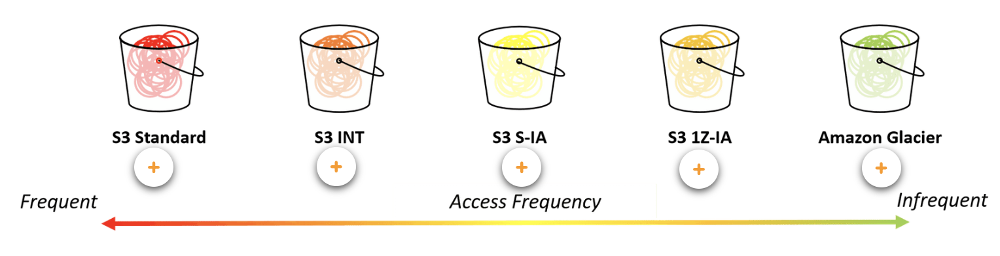

# Data Engineer on AWS

在 Data Scientist 建模過程中可以分成以下四個面向，**資料存取**、**資料探索**、**模型選型與建置**、**模型實驗與優化**。

最終將最佳模型交給 Machine Learning Engineer 做服務部署。

本章主要著重於**資料存取**的部分，在多個 AWS 服務中，依照場景選擇最佳資料存取服務。

--- 

## 1. Storage Services

在 ML 中，資料儲存體的 AWS 服務介紹。

### AWS Lake Formation

#### Source

https://aws.amazon.com/tw/lake-formation/

#### Summary

主要就是一個雲端的 Data Lake Solution。

- Data Lake：
  - 作為大規模資料儲存、分析的 Solution（可能包含多個工具整合）。
  - 用於結構、非結構化資料。
  - 不需要事先定義 Schema。

舉例來說，**AWS S3 就可作為 Data Lake 的儲存層**，結合其他的 AWS 分析工具則可作為一個 Data Lake 的 Solution。

由上述可知，要建構一個完整的 Data Lake 可能牽涉到多個層級的服務，因此 AWS Lake Formation 主要**是簡化和加速構建安全且可配置的 Data Lake 的過程**，可以想像成在 Data Engineer 領域的 K8s，雖然本質差異很大，但出發點都是希望透過簡單的方式快速建置一個龐大的服務。

### AWS S3

- AWS 的雲端儲存層。
- 可對照成 GCP Cloud Storage。或是最簡單可比照成 Google Drive。
- AWS S3 可以跟大多 AWS 服務整合，建置成完整的 Solution。

當資料上傳 S3 時，可以將資料存取頻率、持久性要求以及成本考量來選擇該資料的類別，S3 提供以下幾個類別：

以下為整理後的表格：

| 存儲類別               | 成本              | 存取頻率            | 持久性要求 | 其他特色                                         |
|------------------------|------------------|-------------------|-----------|----------------------------------------------|
| S3 Standard            | 高                | 頻繁                | 高         | 高耐用性和可用性，無最低存儲要求或提早刪除費用    |
| S3 Intelligent-Tiering | 中 (自動調整成本) | 不明確或經常變動    | 高         | 根據存取模式自動在頻繁和不頻繁存取之間移動數據   |
| S3 Standard-IA         | 中（低於 Standard） | 不頻繁，但需快速存取 | 高         | 帶有低檢索費用但有存取費用，適合備份和長期儲存    |
| S3 One Zone-IA         | 更低              | 不頻繁              | 中         | 在單一可用區存儲，成本效益更高，適合非關鍵數據     |
| S3 Glacier             | 很低              | 極少                | 高         | 非常低的存儲成本，數據檢索需處理時間，適合長期存檔 |

在控制頁面時，可以在 Upload file 後選擇：

**注意：S3 絕對不是訓練模型的儲存空間的唯一選擇！**

### AWS FSx

#### Source

https://aws.amazon.com/tw/fsx/

#### Summary

AWS File System Services，分成：
- NetApp ONTAP
- OpenZFS
- Windows File Server 
- Lustre

以機器學習來說，最重要的是 AWS FSx for Lustre，基於 [Lustre](https://zh.wikipedia.org/zh-tw/Lustre) 建置的文件系統。

用途：在訓練時，資料大多會先存在 S3，可以透過 AWS FSx for Lustre 快速將 S3 的資料 Load 到運算服務上 (Sagemaker or EC2) 等等。

舉例：假設我們原本是在 EC2 上進行模型開發，且數據存放在 S3 中，傳統上使用 Boto3 將數據載入到 EC2 進行訓練會導致較長的數據加載時間。因此，我們可以利用 AWS FSx for Lustre，先將數據所在的 S3 bucket 與 FSx for Lustre 整合。這一步會將 S3 中的數據映射到 Lustre 的文件系統中。接著，在 EC2 上掛載這個 FSx 文件系統到指定的資料夾，使 EC2 能以更高速的 Lustre 文件系統存取數據，這樣我們儲存體就是 S3 的龐大空間，文件系統是用快速的 AWS FSx for Lustre，而開發環境又是熟悉的 EC2，可以大幅優化模型開發訓練時間。

### AWS EFS

#### Source

https://aws.amazon.com/tw/efs/

#### Summary

Amazon Elastic File System，同樣也是一個 File System，在掛載後，一樣可以比擬成機器內的一個資料夾，因此如果原本資料就存在 EFS 內，也可以直接拿來跑機器學習訓練。

### 總結

| 文件系統          | 用途                             | 延遲性 | 吞吐量                | 架構特點                              |
|-------------------|--------------------------------|-------|----------------------|-----------------------------------|
| Amazon S3         | 物件存儲，備份和大數據集          | 高     | 低至中                | 高耐用性和可用性，適合靜態數據和備份   |
| Amazon EFS        | 共享文件系統，適合多實例掛載使用  | 中     | 可擴展至高            | 支持 NFS 協議，能自動擴展              |
| Amazon EBS        | 單實例掛載，持久塊存儲            | 低     | 高                    | 高 IOPS 和吞吐量，適合數據庫和重要應用 |
| Amazon FSx Lustre | 高性能計算，需要高 I/O 的工作負載 | 低     | 非常高，支持大規模並行 | 與 S3 整合良好，適合高速數據處理       |

---

## 2. Ingestion solution

